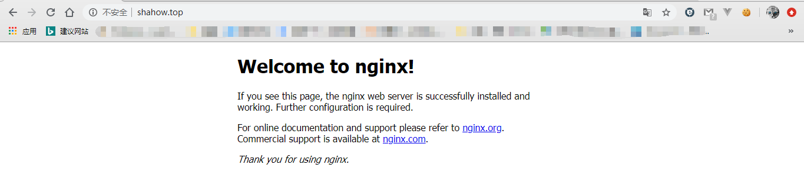
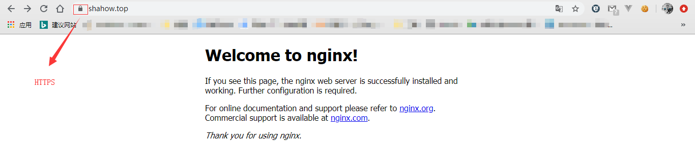

#  nginx安装

###### 准备

```
make zlib zlib-devel gcc-c++ libtool  openssl openssl-devel pcre
```

###### 1、下载nginx

```shell
wget http://nginx.org/download/nginx-1.18.0.tar.gz
```

###### 2、解压

```she
tar -zxvf nginx-1.18.0.tar.gz
```

###### 3、配置

``` shell
cd nginx-1.18.0
./configure --with-http_stub_status_module --with-http_ssl_module
```

返回的配置信息，维护时可能需要用到

```
nginx path prefix: "/usr/local/nginx"
nginx binary file: "/usr/local/nginx/sbin/nginx"
nginx modules path: "/usr/local/nginx/modules"
nginx configuration prefix: "/usr/local/nginx/conf"
nginx configuration file: "/usr/local/nginx/conf/nginx.conf"
nginx pid file: "/usr/local/nginx/logs/nginx.pid"
nginx error log file: "/usr/local/nginx/logs/error.log"
nginx http access log file: "/usr/local/nginx/logs/access.log"
nginx http client request body temporary files: "client_body_temp"
nginx http proxy temporary files: "proxy_temp"
nginx http fastcgi temporary files: "fastcgi_temp"
nginx http uwsgi temporary files: "uwsgi_temp"
nginx http scgi temporary files: "scgi_temp"
```

###### 4、编译安装

```shell
make && make install
```

###### 5、查看版本

```shell
 /usr/local/nginx/sbin/nginx -v
```

```
nginx version: nginx/1.18.0
```

###### 6、相关命令

```shell
/usr/local/nginx/sbin/nginx #运行
/usr/local/nginx/sbin/nginx -s reload # 重新载入配置文件
/usr/local/nginx/sbin/nginx -s reopen # 重启 Nginx
/usr/local/nginx/sbin/nginx -s stop # 停止 Nginx
/usr/local/nginx/sbin/nginx -t #配置文件正确性验证
```

###### 7、访问测试



### https访问

###### 1、下载证书并放置服务器中

[阿里云证书下载及配置文档](https://help.aliyun.com/document_detail/98728.html?spm=5176.2020520163.0.0.28e556a7FridgV)

###### 2、修改/usr/local/nginx/conf/nginx.conf配置文件

找到# HTTPS server，进行如下配置

```
# HTTPS server
#
server {
     listen       443 ssl;
     server_name  shahow.top;

     ssl_certificate      cert/2913461_shahow.top.pem;
     ssl_certificate_key  cert/2913461_shahow.top.key;

     ssl_session_timeout  5m;

     ssl_ciphers  ECDHE-RSA-AES128-GCM-SHA256:ECDHE:ECDH:AES:HIGH:!NULL:!aNULL:!MD5:!ADH:!RC4;
     ssl_protocols TLSv1 TLSv1.1 TLSv1.2;
     ssl_prefer_server_ciphers  on;

     location / {
         root   html;
         index  index.html index.htm;
    }
}

#可以在文件的server中，进行重定向将所有http请求通过rewrite重定向到https
# server {
#     rewrite ^(.*)$ https://$host$1 permanent
# }
```

###### 3、重启nginx

```shell
/usr/local/nginx/sbin/nginx -s reopen # 重启 Nginx
/usr/local/nginx/sbin/nginx #运行
```

###### 4、访问测试




